# Solution Design: CustomerOnboarding

## 1. Document Control

| Field | Value |
|---|---|
| Domain | CustomerOnboarding |
| Jira / Initiative | ARCG-1 |
| Status | Draft |
| Version | 0.1 |
| Last Updated | 2026-05-03 |

## 2. Executive Summary

This document describes the target solution design for CustomerOnboarding. It uses the shared architecture template and includes C1-C4 diagrams, functional design, technical design, security, compliance, operations, risks, and approval sections. Digital bank onboarding journey for retail and SME customers. Goal is to allow customers to open an account digitally via mobile/web. - Customer (Retail / SME)

## 3. Business Context

# Customer Onboarding – Domain Context

## 1. Business Overview
Digital bank onboarding journey for retail and SME customers.
Goal is to allow customers to open an account digitally via mobile/web.

## 2. Actors
- Customer (Retail / SME)
- Bank Operations Team
- Compliance Team

## 3. Channels
- Mobile App
- Web Application

## 4. Core Processes
- User registration
- Identity verification (KYC)
- AML screening
- Document upload and validation
- Account creation
- Notifications (SMS/Email)

## 5. External Systems
- Identity Provider (e.g., Nafath, Yoti, etc.)
- AML/KYC vendors
- Core Banking System
- Notification service (SMS/Email gateway)

## 6. Internal Systems (Target)
- Onboarding Service
- KYC Service
- AML Service
- Document Management Service
- Notification Service
- Audit & Logging Service

## 7. Key Constraints
- Must comply with PCI DSS, ISO 27001
- Full audit trail required
- Secure identity verification (MFA / biometrics)
- Data encryption in transit and at rest
- Regulatory compliance (BAM / FCA style)

## 8. High-Level Flow
1. Customer initiates onboarding via mobile/web
2. Identity verification via external provider
3. KYC + AML checks performed
4. Documents validated
5. Account created in Core Banking
6. Customer notified

## 9. Non-Functional Requirements
- High availability (24/7)
- Scalable onboarding volume
- Low latency for customer interactions
- Observability (logs, metrics, tracing)

## 4. Scope

### 4.1 In Scope

- CustomerOnboarding target solution design
- C1 system context diagram
- C2 container diagram
- C3 component diagram
- C4 code or detailed design diagram
- Security, compliance, operational, and delivery considerations

### 4.2 Out of Scope

- Detailed implementation tickets
- Production runbook content unless explicitly referenced
- Vendor commercial evaluation

## 5. Architecture Diagrams

This solution design follows the C4 model.

### 5.1 C1 System Context Diagram

Reference:

```text
CustomerOnboarding/diagrams/C1.svg
CustomerOnboarding/diagrams/C1.mmd
```



### 5.2 C2 Container Diagram

Reference:

```text
CustomerOnboarding/diagrams/C2.svg
CustomerOnboarding/diagrams/C2.mmd
```



### 5.3 C3 Component Diagram

Reference:

```text
CustomerOnboarding/diagrams/C3.svg
CustomerOnboarding/diagrams/C3.mmd
```



### 5.4 C4 Code / Detailed Design Diagram

Reference:

```text
CustomerOnboarding/diagrams/C4.svg
CustomerOnboarding/diagrams/C4.mmd
```



## 6. Functional Design

### 6.1 Key Capabilities

| Capability | Description | Owning System |
|---|---|---|
| CustomerOnboarding Capability | Supports the target business capability for this domain. | CustomerOnboarding |

### 6.2 Business Rules

| Rule ID | Rule | Owner |
|---|---|---|
| BR-001 | To be confirmed during detailed design. | Product / Architecture |

## 7. Technical Design

### 7.1 System Components

| Component | Responsibility | Notes |
|---|---|---|
| Domain Services | Implement domain orchestration and business behavior. | Derived from domain context. |
| Integration Services | Integrate with upstream and downstream systems. | Protocols to be confirmed. |
| Data Stores | Persist required operational and audit data. | Retention to be confirmed. |

### 7.2 Integration Design

| Source | Target | Pattern | Notes |
|---|---|---|---|
| CustomerOnboarding | External Systems | Sync / Async | Confirm per integration. |

### 7.3 Data Design

| Data Entity | System of Record | Classification | Retention |
|---|---|---|---|
| Domain Data | To be confirmed | Confidential | Per policy |

## 8. Security Design

- Authentication and authorization must align with bank security standards.
- All sensitive data must be encrypted in transit and at rest.
- Privileged access must be controlled and audited.
- Secrets must be stored in approved secret management tooling.
- Audit logging must capture critical customer, operational, and integration events.

## 9. Compliance and Risk

| Requirement | Impact | Mitigation |
|---|---|---|
| PCI DSS / ISO 27001 / Regulatory Requirements | Security and operational controls required. | Apply control framework and architecture review. |

## 10. Non-Functional Requirements

| Category | Requirement | Target |
|---|---|---|
| Availability | Service should support business operating hours and resilience needs. | To be confirmed |
| Performance | User-facing interactions should meet latency expectations. | To be confirmed |
| Scalability | Design should scale with customer and transaction volume. | To be confirmed |
| Observability | Logs, metrics, and traces should support operations. | To be confirmed |
| Maintainability | Design should support independent change and clear ownership. | To be confirmed |

## 11. Operational Design

### 11.1 Monitoring and Alerting

Monitoring should include service health, integration failures, latency, error rates, and business process exceptions.

### 11.2 Support Model

| Support Area | Owner | Notes |
|---|---|---|
| L1 / L2 / L3 | To be confirmed | Define before production release. |

## 12. Deployment and Release

| Environment | Purpose | Notes |
|---|---|---|
| Dev | Engineering validation | To be confirmed |
| Test | Integration and acceptance testing | To be confirmed |
| Prod | Live service | To be confirmed |

Release strategy should define rollback, feature toggles, phased rollout, and operational readiness checks.

## 13. Testing Strategy

| Test Type | Scope | Owner |
|---|---|---|
| Unit | Components and services | Engineering |
| Integration | Internal and external integrations | Engineering |
| Security | Security controls and vulnerabilities | Security |
| UAT | Business acceptance | Product / Business |

## 14. Assumptions, Decisions, and Dependencies

### 14.1 Assumptions

- Domain context is accurate at the time of generation.
- External integration details will be refined during detailed design.

### 14.2 Architecture Decisions

| Decision | Rationale | Date |
|---|---|---|
| Use C4 model for architecture communication | Provides consistent architecture levels from context to detailed design. | 2026-05-03 |

### 14.3 Dependencies

| Dependency | Owner | Risk |
|---|---|---|
| External Systems | To be confirmed | Availability and contract stability |

## 15. Risks and Issues

| ID | Risk / Issue | Impact | Mitigation | Owner |
|---|---|---|---|---|
| R-001 | Requirements or integration details may change. | Medium | Confirm with stakeholders during review. | Architecture |

## 16. Open Questions

| Question | Owner | Target Date |
|---|---|---|
| Which NFR targets are mandatory for launch? | Architecture / Product | To be confirmed |

## 17. Approval

| Role | Name | Approval Date |
|---|---|---|
| Product Owner | TBD | TBD |
| Solution Architect | TBD | TBD |
| Security Architect | TBD | TBD |
| Engineering Lead | TBD | TBD |
| Operations Lead | TBD | TBD |
